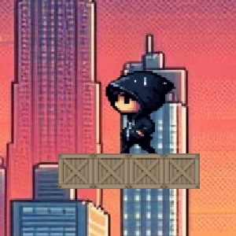
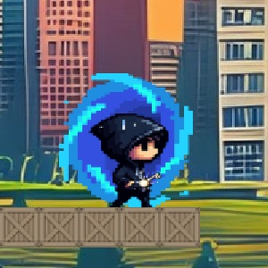
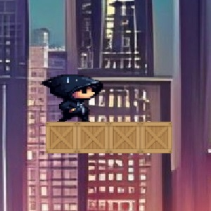
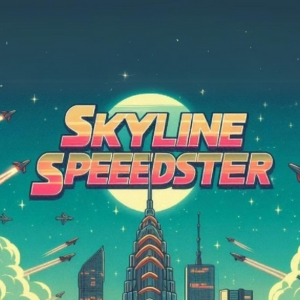
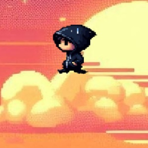
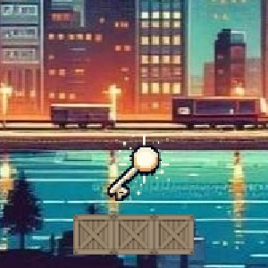
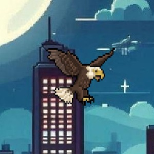
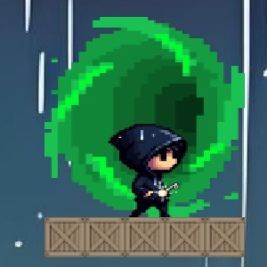

# Skyline Speedster

Skyline Speedster is a 2D platformer style game where the character has to jump from platform to platform up in the sky above the tallest buildings. There are five levels, each level has different backgrounds and object configurations as well as a side scrolling effect when moving left and right. While jumping from platform to platform the player has to avoid being caught by birds. Being caught by birds will result in the bird carrying and dropping the character off the screen. The character has 5 lives and after each death will restart the current level from the spawn position. When the character runs out of lives the game will end and the player will be given an option to play again. The goal of each level is to pick up the key and make it to the exit. The character can move left and right with the left and right arrow keys and can jump with the up arrow key. Also the character sprints while pressing and holding 'z' and crouches when pressing and holding 'x'. To move on to the next level or finish the game the character must have the level key and be in the portal then press the spacebar. To begin the game, press the "play" button on the home screen, there is also a controls button that when pressed shows the game's controls and objectives. To make the graphics for the game, websites like bing image creator, photopia, and canva were used. After completing the game the player's total time is shown as well as the player's remaining lives and total jumps. The character's animation is simple / limited so it does not look as good as it could, but because of this the game can run with less lag and more smoothly. Please enjoy playing Skyline Speedster!

   

  

  
